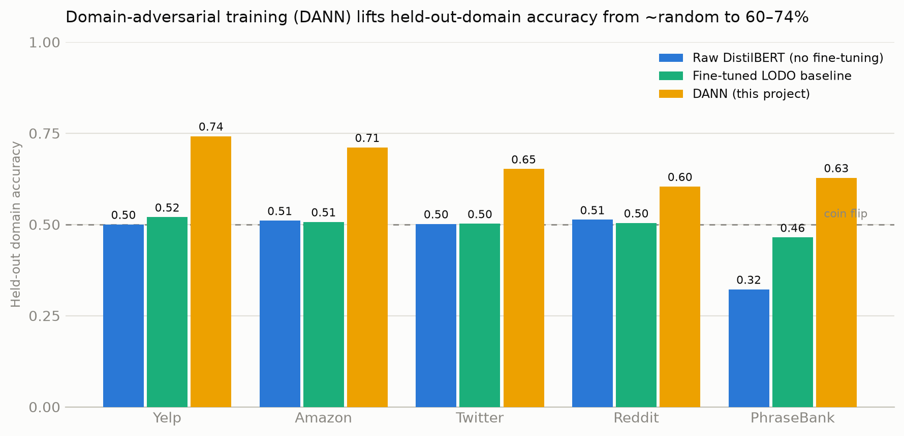
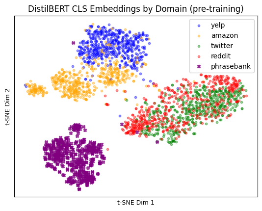
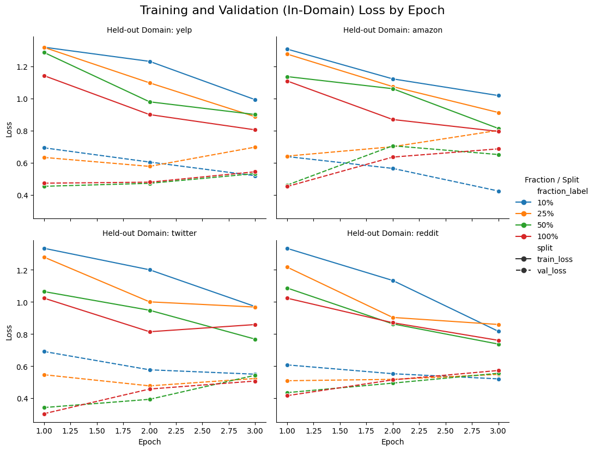
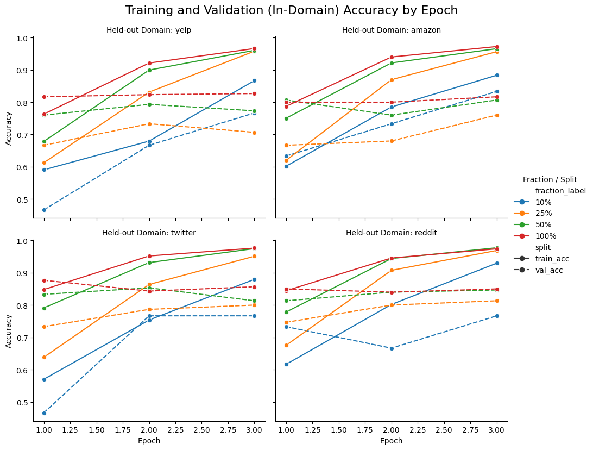

# Cross-Domain Sentiment Classification under Domain Shift

Small-data **domain generalization** for sentiment classification across four
online platforms — Yelp, Amazon, Twitter (X), and Reddit — using DistilBERT, a
**leave-one-domain-out (LODO)** evaluation protocol, and a **Domain-Adversarial
Neural Network (DANN)** with a gradient-reversal layer.

A model trained on product/restaurant reviews often collapses to near-random
accuracy when it meets informal social-media text. This project measures that
domain-shift gap directly and tests whether adversarial domain adaptation can
close it when labeled data is scarce.

> Course research project for **CMSC472 (Introduction to Deep Learning)** at the
> University of Maryland. Full write-up in [`report/final_report.pdf`](report/final_report.pdf);
> the numbers below are as reported there.

<picture>
  <source media="(prefers-color-scheme: dark)" srcset="docs/img/results_dark.png">
  
</picture>

---

## Key results

Under the leave-one-domain-out protocol, the model is trained on three platforms
and tested on a **held-out fourth it never saw during training** — the hard
generalization setting. Financial PhraseBank is an additional out-of-domain probe.

| Model | Yelp | Amazon | Twitter | Reddit | **Avg (4 domains)** | PhraseBank (OOD) |
|---|---|---|---|---|---|---|
| Raw DistilBERT (no fine-tuning) | 0.500 | 0.511 | 0.502 | 0.513 | 0.506 | 0.322 |
| Fine-tuned LODO baseline | 0.520 | 0.507 | 0.502 | 0.504 | 0.508 | 0.464 |
| **DANN (this project)** | **0.742** | **0.711** | **0.652** | **0.604** | **0.677** | **0.628** |
| _Reference: off-the-shelf SST-2 DistilBERT_ | _0.937_ | _0.891_ | _0.649_ | _0.640_ | _0.779_ | _0.705_ |

**Takeaways**

- Domain-adversarial training lifts held-out-domain accuracy from a near-random
  **50.8%** baseline to **67.7%** on average — **+16.9 points** (+33% relative),
  peaking at **74.2%** on Yelp.
- On the toughest out-of-domain set (Financial PhraseBank), DANN improves accuracy
  from **46.4% → 62.8%**.
- Honest context: a general off-the-shelf SST-2 sentiment model still beats DANN on
  the review domains — the win here is over *our own* fine-tuning baseline, trained
  on only ~1,000 labeled examples per domain. The interesting result is the *size of
  the domain-shift gap* and how much adversarial adaptation recovers under data
  scarcity, not a new state of the art.

_(Accuracy on the held-out domain; macro-F1 tracks accuracy closely. Source:
`report/final_report.pdf`, Tables 1–2.)_

---

## Why the domains differ — a look at the representations

Before any adaptation, DistilBERT's `[CLS]` embeddings already cluster by platform:
Yelp and Amazon reviews sit close together, Twitter and Reddit overlap in their own
region, and Financial PhraseBank is off on its own. That separation *is* the domain
shift — the model encodes "which platform" as strongly as "which sentiment," which
is exactly what adversarial training tries to erase.



---

## Method

**Task.** Binary sentiment (positive / negative) on balanced samples drawn from
each platform. Per the report, the base plan draws 16,000 balanced samples per
domain (64,000 total); the DANN experiments use smaller ~1,000-example subsets per
domain because adversarial training is more expensive.

**Leave-one-domain-out (LODO).** For each of the four domains as the held-out
target, train on the other three and evaluate on the target — repeated at four
labeled-data fractions (10% / 25% / 50% / 100%), giving **16 experimental
conditions** that isolate the interaction of *data scarcity* and *domain shift*.

**Domain-generalization techniques.**

| Technique | What it does |
|---|---|
| Text normalization | Lowercasing, emoji→text, URL/mention/hashtag stripping, repeated-char collapse |
| Synonym augmentation | WordNet synonym replacement (~10% of tokens) to diversify limited data |
| Balanced domain sampling | `WeightedRandomSampler` for equal per-domain representation each batch |
| **DANN** | Gradient-reversal layer + adversarial domain-classification head on the shared DistilBERT encoder, pushing it toward domain-invariant features |

**DANN architecture.** A shared DistilBERT encoder feeds two heads: a sentiment
classifier and a domain classifier. A gradient-reversal layer sits before the domain
head, so minimizing domain loss *maximizes* domain confusion in the encoder —
encouraging representations that transfer across platforms.

**Training curves** (per held-out domain, per data fraction):

| Loss | Accuracy |
|---|---|
|  |  |

---

## Repository layout

```
cross_domain_sentiment.ipynb   Main notebook: data prep, LODO base plan, DANN, t-SNE, plots
results/dann_results.csv       Per-epoch DANN training/eval logs (the "small local" run)
report/final_report.pdf        Final write-up (methods, results, analysis)
report/proposal.pdf            Original project proposal
docs/img/                      Figures used in this README
scripts/make_results_chart.py  Regenerates the results bar chart from the reported numbers
requirements.txt               Python dependencies
```

## Reproducing

The notebook was developed in **Google Colab** (GPU recommended) and expects a few
external inputs, so it is not a one-command local run. To reproduce:

1. Open `cross_domain_sentiment.ipynb` in Colab and `!pip install emoji`.
2. Download NLTK data for synonym augmentation:
   ```python
   import nltk; nltk.download("wordnet"); nltk.download("omw-1.4")
   ```
3. Datasets download automatically via `kagglehub` (Yelp; Twitter/Reddit — needs a
   free Kaggle login) and 🤗 `datasets` (Amazon `mteb/amazon_polarity`; Financial
   PhraseBank `financial_phrasebank`, `sentences_75agree`).
4. Run cells top to bottom: data prep → LODO base plan → DANN → evaluation → plots.

To regenerate just the results chart from the reported numbers (no GPU needed):

```bash
pip install matplotlib numpy
python scripts/make_results_chart.py   # writes docs/img/results_{light,dark}.png
```

> **Note on reproducibility.** The datasets are large and some preprocessing steps
> (notably the Financial PhraseBank binary subset) were run interactively in Colab,
> so exact numbers depend on sampling seeds and the Colab environment. The committed
> `results/dann_results.csv` is a small local run; treat the report's tables as the
> canonical figures.

## Datasets

| Domain | Source |
|---|---|
| Yelp | Kaggle `yelp-dataset/yelp-dataset` |
| Amazon | 🤗 `mteb/amazon_polarity` |
| Twitter / Reddit | Kaggle `cosmos98/twitter-and-reddit-sentimental-analysis-dataset` |
| Financial PhraseBank (OOD) | 🤗 `financial_phrasebank` (`sentences_75agree`) |

Raw data is **not** committed — it is fetched at runtime from the sources above.

## Authors

Ivan Wang, Evan Zhang, Unlam Leong, Jessie Gu, Raymond Chen — University of Maryland,
CMSC472.

## License

Code released under the [MIT License](LICENSE). The PDF write-up and proposal in
`report/` are the authors' academic work, included for reference.
